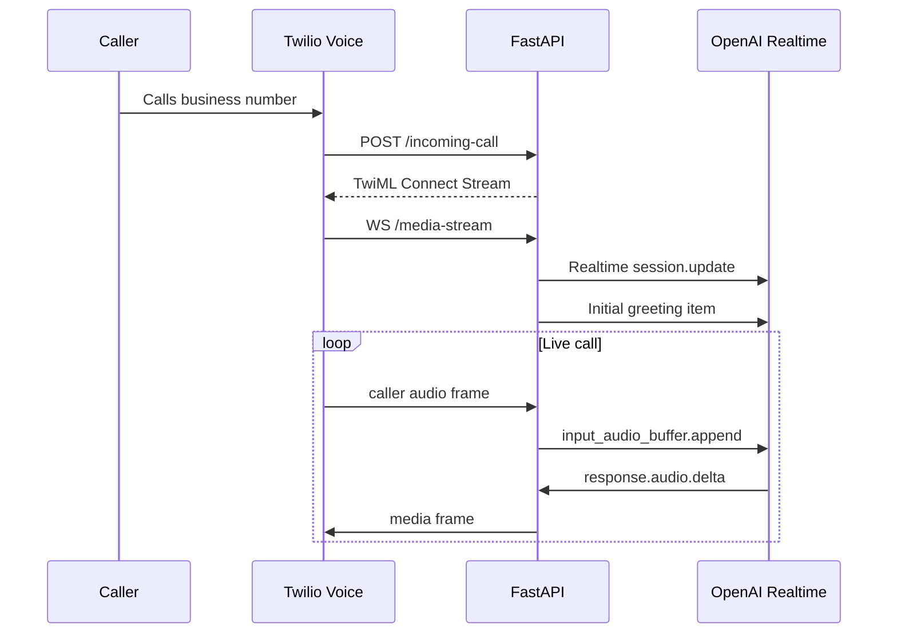
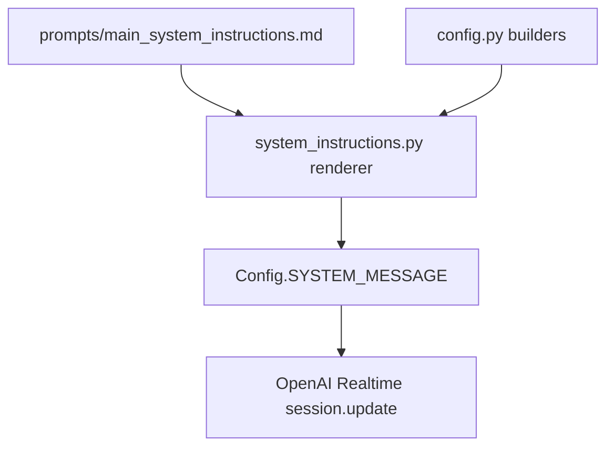
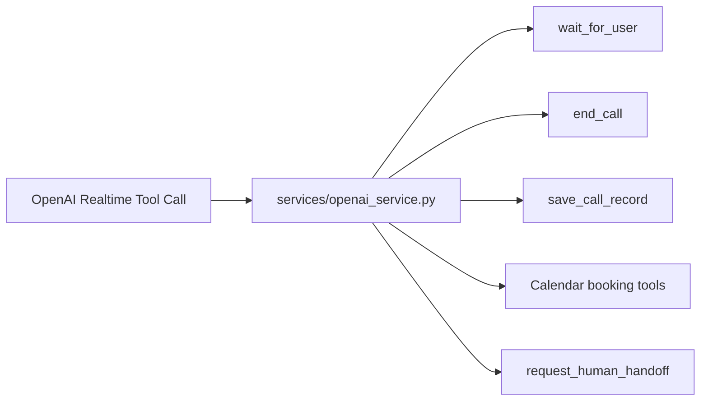
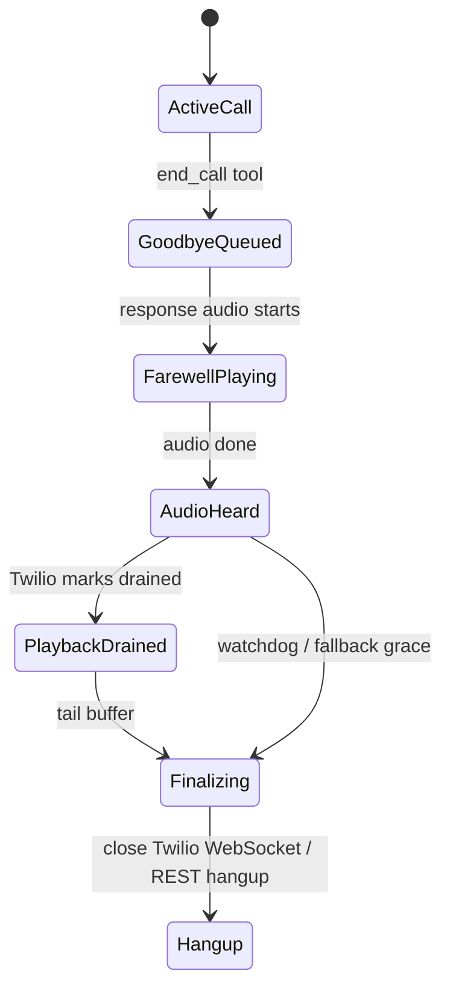
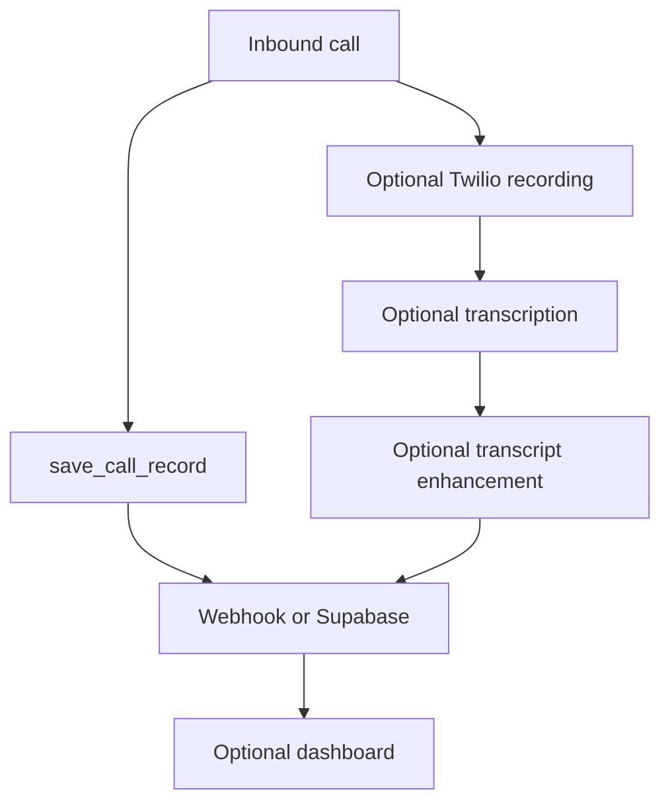
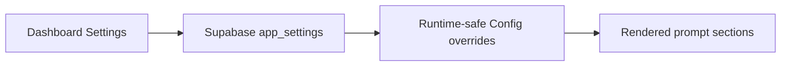

# Inbound Diagrams

This repo is an inbound-only Twilio + OpenAI Realtime starter.

## 1. Inbound Call Sequence

## 2. Prompt Pipeline

Injected placeholders include `{agent_name}`, `{company_name}`, `{delivery_instruction}`, `{language_instruction}`, `{accent_instruction}`, `{reasoning_effort_instruction}`, `{tools_availability_instruction}`, `{call_record_instruction}`, `{booking_instruction}`, and `{transfer_instruction}`.

## 3. Tool Layer

## 4. End-Call Goodbye Flow

## 5. Optional Post-Call Services

## 6. Dynamic Settings Boundary

Runtime-safe settings include voice, tone, warmth, expressiveness, pacing, language, accent, model, VAD, booking, transfer, recording, and dashboard state. Full prompts, industry profiles, and tool policy stay in code.

## 7. What Is Not In This Starter

No outbound campaign APIs, no contact-list dialer, no outbound TwiML endpoint, no outbound status callback, and no missed-call AI callback.
