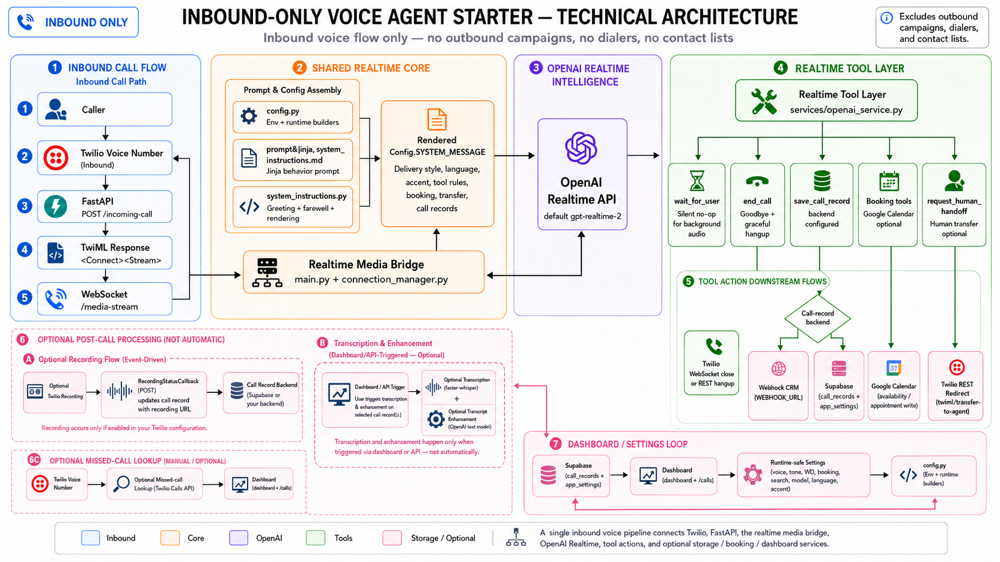
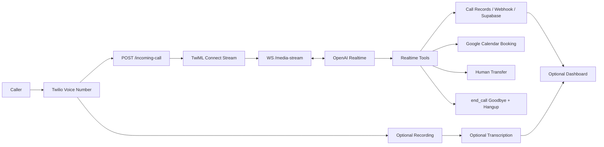

# Inbound Master Architecture

This starter is intentionally inbound-only. It answers live calls that arrive through Twilio Voice and bridges the caller audio to OpenAI Realtime.

## Runtime Steps

1. Caller dials the Twilio Voice number.
2. Twilio requests `/incoming-call`.
3. FastAPI returns TwiML that opens a Media Stream to `/media-stream`.
4. The WebSocket bridge connects Twilio audio to OpenAI Realtime.
5. `Config.SYSTEM_MESSAGE` is rendered from `prompts/main_system_instructions.md`.
6. The model can use enabled tools: `wait_for_user`, `end_call`, `save_call_record`, booking tools, and human handoff.
   `end_call` queues a context-aware farewell, waits for Twilio playback marks to drain, then hangs up.
7. Optional post-call layers update records with recordings, transcripts, and enhanced summaries.

## Intentional Boundary

Outbound campaigns, contact lists, bulk dialers, missed-call AI callbacks, retry logic, and campaign prompts are not part of this starter. Keep those in the separate inbound + outbound repository.
